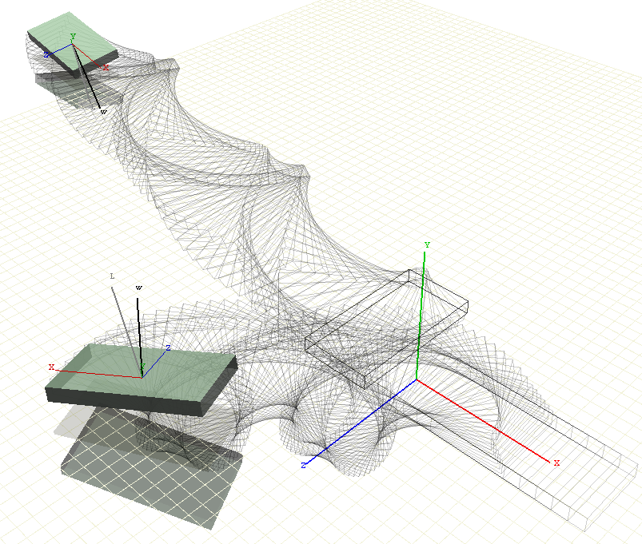

# World of Rigid Bodies

World of Bodies (WoRB) is a framework for the real-time simulation of rigid bodies. 
The full documenation is on <https://mekeetsa.github.io/WoRB/>.

The original purpose of this project was to simulate collisions between rigid bodies using either the impulse method or the penalty method, and to validate the simulation by studying the conservation of energy, linear momentum and angular momentum. Advanced level tasks were to improve the simulation by including frictional contacts, more objects, more complicated collision geometries, articulated bodies using constraints and user control over the objects.

